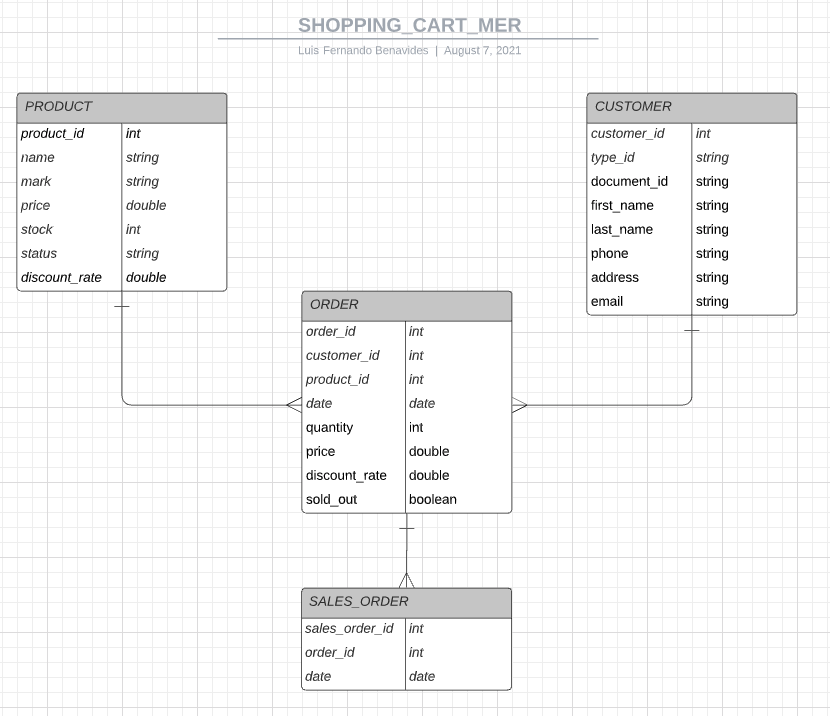

# SpringBoot-StringBatch-Api-ShoppingCart-TechnicalTest
Prueba técnica para validar habilidades de programación con el propósito de aplicar a una vacante de trabajo para el cargo de Desarrollador Java.

## Enunciado de la prueba técnica

Realizar el cargue del catálogo de productos a la base de datos desde un archivo CSV para habilitar su posterior administración y venta a través de la página de la
compañía.

### Primera Parte: cargue del archivo CSV a la base de datos
1. Definir el modelo de datos para almacenar los productos.

2. Implementar un Job Batch que realice la lectura, limpieza y cargue del catálogo de productos a la base de datos. Solo debe cargar productos que tengan toda la información evitando registros duplicados.
- Reader: lee el producto desde el archivo csv.
- Processor: realiza las transformaciones a los datos leídos desde el archivo.
- Writer: escribe el producto en la base de datos.

### Segunda Parte: API REST Carrito de Compras
3. Servicio que permita consultar de manera paginada los productos existentes en la base de datos. El servicio debe soportar la consulta de productos por
los siguientes criterios:
- Por coincidencia del nombre completo o parte de él.
- Por rango de precios.
- Por marca.
4. Servicio para agregar un producto al carrito de compras. El servicio debe validar que haya existencias suficientes del producto antes de ser agregado al carrito.
5. Servicio para consultar los productos agregados en el carrito de compras.
6. Servicio para vaciar el carrito de compras.
7. Servicio que permita finalizar la compra de los productos existentes en el carrito de compras afectando de manera oficial las existencias de los productos en la base de datos.

### Notas:
1. Usar una base de datos en memoria (h2 por ejemplo).
2. Usar el Framework Spring dará un plus en la calificación.
3. Implementar pruebas unitarias dará un plus en la calificación.
4. Manejo de excepciones y Log4j darán un plus en la calificación.
5. Prácticas de código limpio - principios SOLID.

## Configuración de ambiente

Con el proposito de disminuir la compleja tarea de configuración del ambiente de desarrollo se opto por utilizar la tecnología Spring-boot que permite ejecutar aplicaciones Stand-alone. Aunque, también es posible ejecutar las mismas aplicaciones en entornos web con ciertos ajustes de configuración. A continuación, se describirá la manera como debe ser puesta en funcionamiento.

### Maven

Si usted no ha tenido la oportunidad de haber utilizado una herramienta de software, para la gestión y construcción de proyectos, como Maven no se preocupe para el proposito del proyecto es necesario que tenga en cuenta que debe realizar los siguientes pasos para descargar librerias que el proyecto necesita y para validar que el proyecto no presente ninguna inconsistencia. Luego, de descargar el proyecto, en Eclipse, proceda a realizar las siguientes acciones:

- Descargar librerias: en Eclipse, ubicarse encima de la raíz del proyecto y dar boton derecho, buscar la opción en el menú desplegable, "Maven" y luego seleccionar la opción "Update Project...". En ese instante empezara a descargar las librerias necesarias, tomara unos minutos hacerlo.

- Validar que el proyecto no presente inconsistencias: en Eclipse, ubicarse encima de la raíz del proyecto y dar boton derecho, buscar la opción en el menú desplegable, "Run As" y luego seleccionar la opción "Maven install". Al final, en la consola aparecera un mensaje en mayuscula similar a este: "BUILD SUCCESS" si todo esta correcto.

### Diseño solución


### Base de datos relacional

Se utilizo la base de datos relacional embebida que ofrece la tecnología Spring-boot con el fin de agilizar el proceso de implementación. Cabe señalar, que esta base de datos es temporal, es decir los datos regresaran al estado original respetando el script inicial de carga, cuando la aplicación nuevamente es desplegada. De acuerdo con las especificaciones técnicas, las instrucciones DDL se incluyen en el archivo schema.sql y las DML en el archivo data.sql, dentro de la carpeta:

`/src/main/resources`

El modelo datos definido para la solución esta definido en el siguiente modelo entidad relación.




## Iniciar aplicación

Buscar en el proyecto, el archivo:

`com.example.shoppingcart.ShoppingcartController.java`

Dar boton derecho encima de este y buscar la opción en el menú desplegable "Run As", luego seleccionar la opción "Java Application". Despues, en la consola de Eclipse usted podra apreciar como un servidor embebido, propio de la tecnología Spring-boot, inicia. El servidor utiliza el puerto 8081, si actualmente lo esta utilizando opte por dejarlo libre o considere cambiar el puerto en el siguiente archivo de propiedades:

`/src/main/resources/application.properties`

Adicione una linea al final, como el ejemplo:

`server.port=8090`

## Usar aplicación

#### Para utilizar la aplicación usar la siguiente url:

`http://localhost:8081/`

Para cargar los datos de productos mediante el archivo CSV, se debe seleccionar el archivo y dar el botón: Upload File.


## Usar servicios

### GET /product

Servicio que permita consultar de manera paginada los productos existentes en la base de datos. El servicio debe soportar la consulta de productos por los siguientes criterios:

- Por coincidencia del nombre completo o parte de él.
- Por rango de precios.
- Por marca.

Ejemplo:
http://localhost:8081/api/v1/product?name=LG&pricestart=731900&priceend=731900&mark=LG

### POST /order

Servicio para agregar un producto al carrito de compras. El servicio debe validar que haya existencias suficientes del producto antes de ser agregado al carrito

Ejemplo:

***Request***

```json
{
  "customer_id": "1",
  "product_id": "1",
  "quantity": 4
}
```

### GET /ordercustomer

Servicio para consultar los productos agregados en el carrito de compras

Ejemplo:
http://localhost:8081/api/v1/ordercustomer/1

### DELETE /ordercustomer

Servicio para vaciar el carrito de compras

Ejemplo:
http://localhost:8081/api/v1/ordercustomer/1

### POST /salesorder

Servicio que permita finalizar la compra de los productos existentes en el carrito de compras afectando de manera oficial las existencias de los productos en la base de datos

***Request***

```json
{
   "customer_id": "1",
}
```


